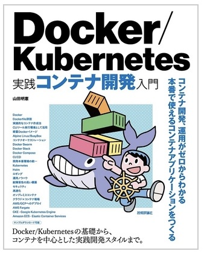
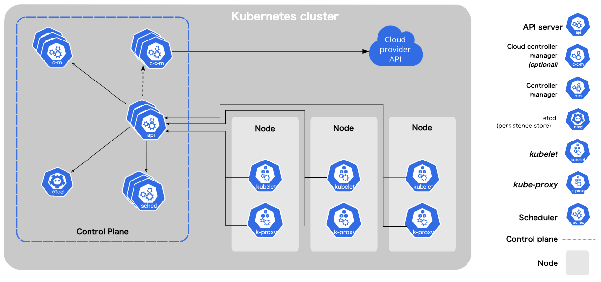
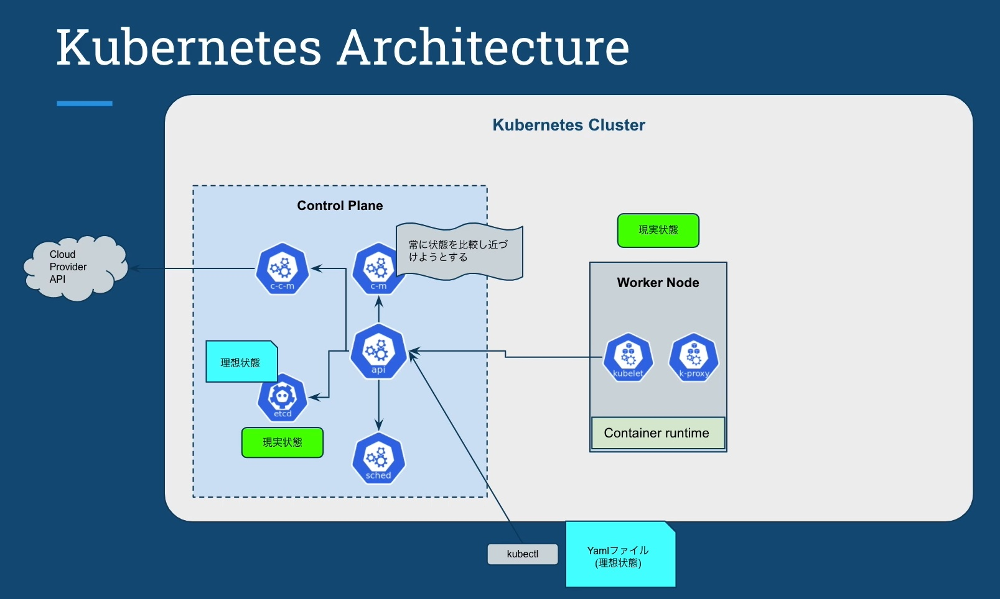
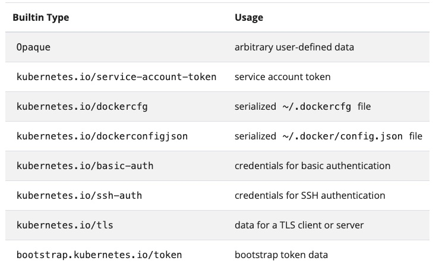

# Kubernetesまとめ

Kubernetesの理解をまとめています。この内容は、以下の書籍の、第５章「Kubernetes入門」に沿って理解を進めています。書籍が古い(2018年)ため、一部用語が古いといったことがあるようです。（✖️ Master Node　→　◯ Control Plane）

[Docker/Kubernetes 実践コンテナ開発入門](https://gihyo.jp/book/2018/978-4-297-10033-9)



<br>

# 基本コマンド
- [こちら](https://kubernetes.io/ja/docs/reference/kubectl/cheatsheet/)の公式チートシートが参考になりそう
  - kubectl config [Contextの設定](https://kubernetes.io/ja/docs/reference/kubectl/cheatsheet/#kubectl%E3%82%B3%E3%83%B3%E3%83%86%E3%82%AD%E3%82%B9%E3%83%88%E3%81%AE%E8%A8%AD%E5%AE%9A)
  - kubectl apply/create/explain [Objectの作成](https://kubernetes.io/ja/docs/reference/kubectl/cheatsheet/#kubectl-apply)
  - kubectl get/describe [リソースの検索と閲覧](https://kubernetes.io/ja/docs/reference/kubectl/cheatsheet/#%E3%83%AA%E3%82%BD%E3%83%BC%E3%82%B9%E3%81%AE%E6%A4%9C%E7%B4%A2%E3%81%A8%E9%96%B2%E8%A6%A7)
  - kubectl set/rollout [リソースの更新](https://kubernetes.io/ja/docs/reference/kubectl/cheatsheet/#%E3%83%AA%E3%82%BD%E3%83%BC%E3%82%B9%E3%81%AE%E3%82%A2%E3%83%83%E3%83%97%E3%83%87%E3%83%BC%E3%83%88)
  - kubectl patch [リソースへのパッチ適用](https://kubernetes.io/ja/docs/reference/kubectl/cheatsheet/#%E3%83%AA%E3%82%BD%E3%83%BC%E3%82%B9%E3%81%B8%E3%81%AE%E3%83%91%E3%83%83%E3%83%81%E9%81%A9%E7%94%A8)
  - kubectl edit [リソースの編集](https://kubernetes.io/ja/docs/reference/kubectl/cheatsheet/#%E3%83%AA%E3%82%BD%E3%83%BC%E3%82%B9%E3%81%AE%E7%B7%A8%E9%9B%86)
  - kubectl scale [リソースのスケーリング](https://kubernetes.io/ja/docs/reference/kubectl/cheatsheet/#%E3%83%AA%E3%82%BD%E3%83%BC%E3%82%B9%E3%81%AE%E3%82%B9%E3%82%B1%E3%83%BC%E3%83%AA%E3%83%B3%E3%82%B0)
  - kubectl delete [リソースの削除](https://kubernetes.io/ja/docs/reference/kubectl/cheatsheet/#%E3%83%AA%E3%82%BD%E3%83%BC%E3%82%B9%E3%81%AE%E5%89%8A%E9%99%A4)
  - kubectl logs [実行中のポッドとの対話処理](https://kubernetes.io/ja/docs/reference/kubectl/cheatsheet/#%E5%AE%9F%E8%A1%8C%E4%B8%AD%E3%81%AE%E3%83%9D%E3%83%83%E3%83%89%E3%81%A8%E3%81%AE%E5%AF%BE%E8%A9%B1%E5%87%A6%E7%90%86)

<br>

- 特定の形式で端末ウィンドウに詳細を出力するには、サポートされているkubectlコマンドに[-o(または--output)フラグを追加](https://kubernetes.io/ja/docs/reference/kubectl/cheatsheet/#%E5%87%BA%E5%8A%9B%E3%81%AE%E3%83%95%E3%82%A9%E3%83%BC%E3%83%9E%E3%83%83%E3%83%88s)する。
  ```sh
  # クラスター内で実行中のすべてのイメージ名を表示する
  kubectl get pods -A -o=custom-columns='DATA:spec.containers[*].image'

  # "k8s.gcr.io/coredns:1.6.2"を除いたすべてのイメージ名を表示する
  kubectl get pods -A -o=custom-columns='DATA:spec.containers[?(@.image!="k8s.gcr.io/coredns:1.6.2")].image'

  # 名前に関係なくmetadata以下のすべてのフィールドを表示する
  kubectl get pods -A -o=custom-columns='DATA:metadata.*'
  ```

<br>

# Kubernetesリソース
## 一覧

|リソース名|用途|(理解)|
|--|----|--|
|Pod|コンテナ集合体の単位でコンテナを実行する方法を定義する|済|
|Node|Kubernetesクラスタで実行するコンテナを配置するためのサーバ|済？|
|ReplicaSet|同じ仕様のPodを複数生成・管理する|済|
|StatefulSet|同じ仕様で一意性のあるPodを複数生成・管理する|
|DaemonSet|???|
|Deployment|ReplicaSetの世代管理をする|済|
|Service|Podの集合にアクセスするための経路を定義する|
|Ingress|ServiceをKubernetesクラスの外に公開する|
|Configmap|設定情報を定義し、Podに供給する|
|Secret|認証情報等の機密データを定義する|
|Job|常駐目的ではない複数のPodを作成し、正常終了することを保証する|
|CronJob|cron表記でスケジューリング|
|ClusterIp|???|

<br>

## 詳細

<br>

### Pod
- 単体または複数のコンテナを一纏めにした単位。~~Kubernetesでのデプロイ、スケーリングはこの単位で操作する。~~ (デプロイは、後述のDeploymentで操作する。Pod自体の定義は、最小単位と捉えるのが良さそう）
- 複数コンテナが密結合を望ましい構成の場合には、複数コンテナをPodとしてまとめる。WebサーバとWebAppサーバ等。

<br>

### Node
- Kubernetesのクラスタ下にあるリソースの集合体。<u>コンテナをデプロイするのに使用される</u>
- Kubernetesクラスタには、最低でも一つの「Control Plane」~~「Master Node」~~ が存在し、n個のControl Planeと、m個のそれ以外のNodeに分かれる。(Master Nodeというのは、古い呼び方らしい)
  
- Control Planeには、次の管理コンポーネントが存在する。
  |コンポーネント名|役割|
  |--|--|
  |kube-apiserver|KubernetesのAPIを公開するコンポーネント。kubetctlからのリソースの役割を受け付ける|
  |etcd|高可用性を備えた分散キーバリューストアで、Kubernetesクラスタのバッキングストアとして利用される|
  |kube-scheduler|Nodeを監視し、コンテナを配置する最適なNodeを選択する。|
  |kube-controller-manager|リソースを制御するコントローラーを実行する|
- 一般的には、Control Planeは３台配置して単一障害点とならないように構成するとのこと。  
------
#### 以下、課題・理解不足

  - <i><u>「デプロイするのに使われる」がよくわからない。Control Planeがそれを担う？それ以外のNode（Worker Node?）は、デプロイ先と解釈しているが違うのか？ </i></u>
  - <i><u>Master以外のノード(Worker Node?)と、後述のReplicaSet、Deploymentを使用したデプロイの関係がわからない。後述のリソースを読み進めると、Containerの集まりであるPodを、Deploymentを使ってデプロイすると理解している。が、ここの説明にNodeは出てこない。デプロイ先として指定するものではないのか？</i></u>  

    → あっている。Control Plane(AzureではAKSが担当)が、ワーカノードに対してデプロイを行う。デプロイ先は、各種yamlファイルにある[「Node Selector」で指定する](https://kubernetes.io/ja/docs/concepts/scheduling-eviction/assign-pod-node/)が指定する。例えば、GPUのプラットフォームに配置する場合や、専有(Dedecated)に配置するといった場合。指定しなければ、自動で配置される。
  - Master Nodeのコンポーネント内容は、ほとんど理解できていない。
  - AKSで構成した場合、このMaster NodeがAKSクラスタとなる、という認識であっているか？
  - AKSなりEKSで実際に構築してみないと、オンプレミスとの違いはわからない・・・。


<br>

### ReplicaSet
- <u> ReplicaSetはレプリカ数を制御する単位として把握すれば良い。実際には後述のDeploymentを使って世代管理を含めて操作することが多いため、ReplicaSet.yamlを直接操作する機会は少ない。 </u>
- ReplicaSet.yaml(ファイル名は任意)に構成を記述する。
  ``` yml
  apiVersion: apps/v1
  kind: ReplicaSet
  :
  spec:
    replicas: 3
    template: # template以下はPodリソースにおける定義と同じ
    :
    spec:
      containers:
      - name: nginx
        images: nginx:x.x.x
        env:
        :
  ```
  各種パラメタについては、[公式リファレンスを参照](https://kubernetes.io/ja/docs/concepts/workloads/controllers/replicaset/)

- 同じPodを指定した数だけ複製させるためのKubernetesリソース。
- 上記の`replicas`に、複製する個数を記載する。
- 適用コマンドは次の通り。
  > kubectl apply -f xxx_replicaset.yaml
- Podの数を減らすと、減らした分のPodは削除される。
- 以下のように、ReplicaSet自体を削除すると、関連するPodも削除される
  > kubectl delete -f xxx_replicaset.yaml

<br>

### Deployment
- アプリケーションをデプロイする際の基本単位となるKubernetesリソース。
- クラスタ化・冗長化構成をもったシステム全体に対し、世代管理によるデプロイ・ロールバックを行う。
- Deployment.yaml(ファイル名は任意)に構成を記述する。
  ``` yml
  apiVersion: apps/v1
  kind: Deployment  # ← ReplicaSetとはここが違う・・・。ぐらい。
  :
  spec:
    replicas: 3
    template: # template以下はPodリソースにおける定義と同じ
    :
    spec:
      containers:
      - name: nginx
        images: nginx:x.x.x
        env:
        :
  ```
  各種パラメタについては、[公式リファレンス](https://kubernetes.io/ja/docs/concepts/workloads/controllers/deployment/)を参照。

- <b><h4>デプロイ</h4></b>

  - 適用コマンドは次の通り。
    > kubectl apply -f xxx_reployment.yaml --record

  - `--record`を付与することによって、デプロイの履歴を以下のコマンドで確認できるようになる。
    > kubectl rollout history deployment [app_name]
    ```sh
    REVISION  CHANGE-CAUSE
    1         kubectl apply -f xxx_reployment.yaml --record=true
    ```

- <b><h4>デプロイ（更新）</h4></b> 

  - コマンドは`デプロイ`と同じ。
  - コンテナの定義、または構成を変更して再デプロイすることで、REVISIONがインクリメントされ、新しいPodがロードされていく。古いPodは段階的に停止されていく。
  - ymlの`replicas`のみを増減させた場合、指定された値に沿ってPodの増減は行われるが、REVISIONは変わらない。
    > kubectl apply -f xxx_deployment.yaml --record   # replicasを3→4へ変更

    ```sh
    NAME                    READY     STATUS                RESTARTS  AGE
    echo-5f978bc465-5vdnl   2/2       Running               0         6m
    echo-5f978bc465-9zjsa   2/2       Running               0         7m
    echo-5f978bc465-3e204   0/2       ContainerCreaeting    0         6m
    echo-5f978bc465-182b0   2/2       Running               0         7m
    ```

- <b><h4>ロールバック</h4></b>

  - 適用コマンドは次の通り `undo`。これにより、直前のリリース構成が復元される。
    > kubectl rollout undo deployment [app_name]

  - 事前にロールバックの内容を確認したい場合は、次のコマンドで内容を確認できる。
    > \# REVISIONの一覧を表示
    > kubectl rollout history deployment [app_name]
    > \# 指定したREVISIONの構成内容(deployment.yaml)を表示
    > kubectl rollout history deployment [app_name] --revision=1


<br>

# Udemy講義 「Kubernetes入門」
## 座学
- Control Planeとワーカー(Node)が存在し、Control Planeが入力されたYmlに記述された内容（Desired State（理想状態））と、現実状態を比較しながら、常に理想状態を担保するよう動く。
- Control Planeからの指示は、ワーカー内のKubeletが受け取って処理をする。

### Kubectl Architecture

- 制御の流れは以下の通り。

  

  1. kubectlコマンドで理想状態であるyml定義をControl Plane「KubeAPI Server」に渡す。
  2. 渡された理想状態はControl Plane「etcd」データベースに保存される。
  3. ワーカーにいるエージェントの「Kubelet」が各ノードの現実状態を Control Plane「KubeAPI Server」に通知し「etcd」に保存される。
  4. Controle Plane「Control Manager」(c-m)が、現実状態を理想幼体に近づけようとする。

## 環境構築（補足）
- Kubernetes自体のインストールは、Docker-Desktopの設定画面で、Kubernetesを有効化するだけ。
- kubectlのセットアップはこちらに従って行うこと。
  - [Macの場合](https://kubernetes.io/docs/tasks/tools/install-kubectl-macos/)
  - [Windowsの場合](https://kubernetes.io/docs/tasks/tools/install-kubectl-windows/)
- セットアップ後、環境設定として、ファイル`~/.kube/config`が保存されている。
- 上記内容のうち、`current-context`と書かれている内容が接続する先のContext。以下のコマンドでも確認できる。
  > kubectl config current-context

## 実践

### kubectl基礎
- 基礎構文は以下。
  > kubectl [command] [TYPE] [NAME] [flgas]

- 以下が実行例となる
  ``` sh
  kubectl get node

  NAME             STATUS   ROLES                  AGE     VERSION
  docker-desktop   Ready    control-plane,master   3d22h   v1.22.4
  ```
- `-o`をつけることで出力内容を変更できる。

  - `-o wide`：デフォルトよりも多いカラム情報を出力できる

    - 例）通常
      ``` sh
      kubectl get node 

      NAME             STATUS   ROLES                  AGE     VERSION
      docker-desktop   Ready    control-plane,master   6d20h   v1.22.4
      ```

    - 例）wideを指定
      ``` sh
      kubectl get node -o wide

      NAME             STATUS   ROLES                  AGE     VERSION   INTERNAL-IP    EXTERNAL-IP   OS-IMAGE         KERNEL-VERSION     CONTAINER-RUNTIME
      docker-desktop   Ready    control-plane,master   6d20h   v1.22.4   192.168.65.4   <none>        Docker Desktop   5.10.76-linuxkit   docker://20.10.11
      ```

  - `-o json`,`-o yml`：詳細を表示。形式を指定できる。

- nameの引き当ては、完全一致であること（prefixとしたい場合は、describeを用いるべし）

#### kubectl describe

リソースの詳細情報を表示させることができる。

- 基礎構文は以下。出力はymlとなる。
  > kubectl descibe [TYPE] [NAME] [flgas]

- 実行例としては次のようなもの。IPアドレスや、リソース割り当てを確認できる。

  ```sh
    # nodeの詳細情報を表示させる
    kubectl describe node docker-desktop

    Name:               docker-desktop
    Roles:              control-plane,master
    Labels:             beta.kubernetes.io/arch=arm64
                        beta.kubernetes.io/os=linux
                        kubernetes.io/arch=arm64
                        kubernetes.io/hostname=docker-desktop
                        kubernetes.io/os=linux
                        node-role.kubernetes.io/control-plane=
                        node-role.kubernetes.io/master=
                        node.kubernetes.io/exclude-from-external-load-balancers=
    Annotations:        kubeadm.alpha.kubernetes.io/cri-socket: /var/run/dockershim.sock
                        node.alpha.kubernetes.io/ttl: 0
                        volumes.kubernetes.io/controller-managed-attach-detach: true
    CreationTimestamp:  Mon, 23 Jan 2023 15:14:04 +0900
    Taints:             <none>
    Unschedulable:      false
    Lease:
    HolderIdentity:  docker-desktop
    AcquireTime:     <unset>
    RenewTime:       Mon, 30 Jan 2023 11:51:35 +0900
    Conditions:
    Type             Status  LastHeartbeatTime                 LastTransitionTime                Reason                       Message
    ----             ------  -----------------                 ------------------                ------                       -------
    MemoryPressure   False   Mon, 30 Jan 2023 11:51:23 +0900   Mon, 23 Jan 2023 15:14:03 +0900   KubeletHasSufficientMemory   kubelet has sufficient memory available
    DiskPressure     False   Mon, 30 Jan 2023 11:51:23 +0900   Mon, 23 Jan 2023 15:14:03 +0900   KubeletHasNoDiskPressure     kubelet has no disk pressure
    PIDPressure      False   Mon, 30 Jan 2023 11:51:23 +0900   Mon, 23 Jan 2023 15:14:03 +0900   KubeletHasSufficientPID      kubelet has sufficient PID available
    Ready            True    Mon, 30 Jan 2023 11:51:23 +0900   Mon, 23 Jan 2023 15:29:47 +0900   KubeletReady                 kubelet is posting ready status
    Addresses:
    InternalIP:  192.168.65.4
    Hostname:    docker-desktop
    Capacity:
    cpu:                4
    ephemeral-storage:  61255492Ki
    hugepages-1Gi:      0
    hugepages-2Mi:      0
    hugepages-32Mi:     0
    hugepages-64Ki:     0
    memory:             2036420Ki
    pods:               110
    Allocatable:
    cpu:                4
    ephemeral-storage:  56453061334
    hugepages-1Gi:      0
    hugepages-2Mi:      0
    hugepages-32Mi:     0
    hugepages-64Ki:     0
    memory:             1934020Ki
    pods:               110
    System Info:
    Machine ID:                 43a7dc78-d903-4863-b53e-3fd50ba4a66a
    System UUID:                43a7dc78-d903-4863-b53e-3fd50ba4a66a
    Boot ID:                    f40b8083-2ade-4b3f-9592-8142cc9dfbef
    Kernel Version:             5.10.76-linuxkit
    OS Image:                   Docker Desktop
    Operating System:           linux
    Architecture:               arm64
    Container Runtime Version:  docker://20.10.11
    Kubelet Version:            v1.22.4
    Kube-Proxy Version:         v1.22.4
    Non-terminated Pods:          (9 in total)
    Namespace                   Name                                      CPU Requests  CPU Limits  Memory Requests  Memory Limits  Age
    ---------                   ----                                      ------------  ----------  ---------------  -------------  ---
    kube-system                 coredns-78fcd69978-7jzd8                  100m (2%)     0 (0%)      70Mi (3%)        170Mi (9%)     6d20h
    kube-system                 coredns-78fcd69978-tspbg                  100m (2%)     0 (0%)      70Mi (3%)        170Mi (9%)     6d20h
    kube-system                 etcd-docker-desktop                       100m (2%)     0 (0%)      100Mi (5%)       0 (0%)         6d20h
    kube-system                 kube-apiserver-docker-desktop             250m (6%)     0 (0%)      0 (0%)           0 (0%)         6d20h
    kube-system                 kube-controller-manager-docker-desktop    200m (5%)     0 (0%)      0 (0%)           0 (0%)         6d20h
    kube-system                 kube-proxy-m6z6s                          0 (0%)        0 (0%)      0 (0%)           0 (0%)         6d20h
    kube-system                 kube-scheduler-docker-desktop             100m (2%)     0 (0%)      0 (0%)           0 (0%)         6d20h
    kube-system                 storage-provisioner                       0 (0%)        0 (0%)      0 (0%)           0 (0%)         6d20h
    kube-system                 vpnkit-controller                         0 (0%)        0 (0%)      0 (0%)           0 (0%)         6d20h
    Allocated resources:
    (Total limits may be over 100 percent, i.e., overcommitted.)
    Resource           Requests     Limits
    --------           --------     ------
    cpu                850m (21%)   0 (0%)
    memory             240Mi (12%)  340Mi (18%)
    ephemeral-storage  0 (0%)       0 (0%)
    hugepages-1Gi      0 (0%)       0 (0%)
    hugepages-2Mi      0 (0%)       0 (0%)
    hugepages-32Mi     0 (0%)       0 (0%)
    hugepages-64Ki     0 (0%)       0 (0%)
    Events:              <none>
  ```

#### kubectl create/delete
リソースの作成・削除を行う。

- 基礎構文は以下。出力はymlとなる。
  > kubectl create/delete -f [filename]
  - 例）
    ```sh
    kubectl create -f ./assets/sample/create/pod-test.yaml
    ```

### リソースタイプ

- `--dry-run=client` 実際に送信することなく、送信されるオブジェクトを確認することができる。
  - 例）空のnamespaceであるteam-bを作成する命令をyaml形式で取得する
    ``` sh
    kubectl create ns team-b --dry-run=client -o yaml
    # → この結果を、team-b.yaml として保存すれば、編集に活用できる。
    ```
####  ワークロードリソース
- podテンプレート
  - 例 replicaset
    ``` yml
    apiVersion: apps/v1
    kind: ReplicaSet
    metadata:
      name: nginx
      labels:
        app: nginx
    spec:
        replicas: 3
        selector:
          matchLabels:
            app: nginx
        template:
          metadata:
            labels:
              app: nginx
          spec:
            containers:
              - name: nginx
                  image: nginx:x.x.x
                  env:
                  :
    ```

- replicaset
  - matchLabels.name と tempale.metadaa.labels.name は同じである必要がある。
  - replicasetの使用は奨励されない。世代管理機能を加えたDeploymentリソースが上位にあるため、そちらを使用する。
  - スケールさせるには、以下の２つの方法がある。
    - yamlの`replicas`を増減させて、再度`apply`する。
    - コマンド`kubectl scale rs(replicaset)/[name] --replicas=[数]`を実行する。
      > kubectl scale rs/nginx --replicas=3

- deployment
  - パラメタ説明補足
    - `strategy`(更新戦略)
      - RollingUpdate ダウンタイムが許されない場合の更新方法
        - maxUnavailable 停止状態になる最大 Pod数(絶対値、またはパーセンテージ)
        - maxSurge 宣言した Pod 数を超えて作れる Pod数(絶対値、またはパーセンテージ)
        - ※ 上記の設定に関する詳細は[こちら](https://kakakakakku.hatenablog.com/entry/2021/09/06/173014)を参照。

  - デプロイ（rollout）の実行方法は、以下の２つの方法がある。
    - `apply`コマンドで実行する場合
      ``` sh
      # kubectl apply -f [yamlファイル名] 
      $ kubectl apply -f deployment.yml
      deployment.apps/nginx 
      ```
    - 直接、Deployment内容を更新する場合
      ``` sh
      # kubectl set image deployment/[deploymentの名前] [containers内のname]
      $ kubectl set image deployment/nginx nginx=nginx:1.15
      ```
  - ロールバックする流れは以下の通り
    ``` sh
    # 過去の履歴を表示する。
    $ kubectl rollout history deployment.v1.apps/nginx
    REVISION  CHANGE-CAUSE
    4         <none>
    5         <none>
    6         <none>

    # 指定したリビジョンに戻す
    $ kubectl rollout undo deployment.v1.apps/nginx --to-revision=4
    deployment.apps/nginx rolled back

    # 現在展開されているreplicasetを確認する。まずは一覧表示。
    $ kubectl get rs  # ←`rs`はreplicasetでも良い
    NAME               DESIRED   CURRENT   READY   AGE
    nginx-6d4cf56db6   2         2         2       2m23s
    nginx-764b95f4c5   0         0         0       47s
    # 2世代が表示されており、前者が2稼働しているため、最新。

    # 前者のreplicasetの詳細を確認。
    $ kubectl get rs nginx-6d4cf56db6 -o yaml
    apiVersion: apps/v1
    kind: ReplicaSet
    metadata:
      annotations:
        deployment.kubernetes.io/desired-replicas: "2"
        deployment.kubernetes.io/max-replicas: "3"
        deployment.kubernetes.io/revision: "2"
        deployment.kubernetes.io/revision-history: "1"
      creationTimestamp: "2023-02-02T05:48:59Z"
      generation: 5
      labels:
        app: nginx
        pod-template-hash: 6d4cf56db6
      name: nginx-6d4cf56db6
      namespace: default
      ownerReferences:
      - apiVersion: apps/v1
        blockOwnerDeletion: true
        controller: true
        kind: Deployment
        name: nginx
        uid: 5181ec0f-a630-4e3d-a06b-afbb0ea2cc41
      resourceVersion: "124730"
      uid: e1a856b5-501b-4119-ad4d-cdb784809ebb
    spec:
      replicas: 2
      selector:
        matchLabels:
          app: nginx
          pod-template-hash: 6d4cf56db6
      template:
        metadata:
          creationTimestamp: null
          labels:
            app: nginx
            pod-template-hash: 6d4cf56db6
        spec:
          containers:
          - image: nginx:1.16    # ここにコンテナ内容が出る。
            imagePullPolicy: IfNotPresent
            name: nginx
            resources: {}
            terminationMessagePath: /dev/termination-log
            terminationMessagePolicy: File
          dnsPolicy: ClusterFirst
          restartPolicy: Always
          schedulerName: default-scheduler
          securityContext: {}
          terminationGracePeriodSeconds: 30
    status:
      availableReplicas: 2
      fullyLabeledReplicas: 2
      observedGeneration: 5
      readyReplicas: 2
      replicas: 2
    ```

- configMap
  - 機密性のない設定データをキーと値のペアで保存し、Podから参照させるもの
  - 使用用途と使用方法（４つあるが、２つ紹介）
    1. コンテナの環境変数の設定
      - ファイル構成  
        ConfigMap定義
        ```yaml
        apiVersion: v1
        kind: ConfigMap
        metadata:
          name: test-config
        data:
          TEST_ENV: test
        ```
        ConfigMapを使用するPod
        ```yaml
        apiVersion: v1
        kind: Pod
        metadata:
          name: test-pod
        spec:
          containers:
            - name: busybox
              image: k8s.gcr.io/busybox
              command: ["env"] # print env var
              # ここ↓で上のConfigMapを指定
              envFrom:
                - configMapRef:         
                    name: test-config
          restartPolicy: Never
        ```
      - 実行確認
        ``` sh
        # configMapとpodを生成
        $ kubectl apply -f configmap-env-var.yaml
        # 起動したpodの出力を確認（上記のPrint）
        $ kubectl logs test-pod
        HOME=/root
        KUBERNETES_PORT_443_TCP_PORT=443
        KUBERNETES_PORT_443_TCP_PROTO=tcp
        KUBERNETES_PORT_443_TCP=tcp://10.96.0.1:443
        KUBERNETES_PORT=tcp://10.96.0.1:443
        KUBERNETES_SERVICE_PORT_HTTPS=443
        KUBERNETES_SERVICE_PORT=443
        KUBERNETES_SERVICE_HOST=10.96.0.1
        KUBERNETES_PORT_443_TCP_ADDR=10.96.0.1
        TEST_ENV=test   # ←　ここに設定されている
        HOSTNAME=test-pod
        PATH=/usr/local/sbin:/usr/local/bin:/usr/sbin:/usr/bin:/sbin:/bin
        ```

    2. 読み取り援用のボリュームを作成し、コンテナから読み込む
      - ファイル構造
        ``` yaml
        apiVersion: v1
        kind: ConfigMap
        metadata:
          name: test-file
        data:
          # ↓ 実体化するファイル名
          data.csv: |
            name,age,email,password
            naka,1,naka@example.com,j4gn43g4gr
            tanaka,2,tanaka@example.com,9skjeldod

            # ↑ ファイルに記述する内容

        # --- で区切ることができる
        ---
        apiVersion: v1
        kind: Pod
        metadata:
          name: test-pod
        spec:
          restartPolicy: Never
          containers:
          - name: busybox
            image: k8s.gcr.io/busybox
            command: ["sleep", "3600"]
            # 後述のVolumes定義を参照
            volumeMounts:
            - name: config # ← この名前を下と併せる
              mountPath: "/datadir" # 配置するディレクトリ
              readOnly: true
          volumes:
          - name: config
            configMap:
              name: test-file
        ```
      - 実行確認
      ``` sh
      # configmapとpodを生成
      kubectl apply -f configmap-file.yaml
      # 生成したpod(sleep状態)に、ログイン
      kubectl exec -it test-pod sh
      # ファイルの内容を確認する
      $ cat datadir/data.csv
      name,age,email,password
      naka,1,naka@example.com,j4gn43g4gr
      tanaka,2,tanaka@example.com,9skjeldod
      ```
- secret
  - 機密性が高い設定データをキーと値のペアで保存し、Podから参照させるもの

  - Secretには、いくつかの種類がある([公式サイト](https://kubernetes.io/ja/docs/concepts/configuration/secret/#secret-types)を参照)。  

    
  
    - Opaque（オペイク）という記述が最もよく使われる。ユーザが定義したデータをSecretに保存するもの。

  - 構文
    ``` yaml
    apiVersion: v1
    kind: Secret
    metadata:
      name: mysecret
      namespace: default
    type: Opaque      # type
    data:
      username: YWRtaW4= # admin
      password: MWYyZDFlMmU2N2Rm # 1f2d1e2e67df
    ```
  - data部分は、以下のいずれかで書くことができる。
    - `data` : base64 encodeデータ
      ```yaml
      data:
        username: YWRtaW4= # admin
        password: MWYyZDFlMmU2N2Rm # 1f2d1e2e67df
      ``` 
    - `stringData` : plainデータ
      ```yaml
      stringData:
        username: admin
        password: 1f2d1e2e67df
      ``` 
  - ファイル記述のパターンは、[こちら](./assets/sample/secret/)を参照。
  - base64でのエンコードする方法
    ```sh
    # base64 encode
    $ echo -n 'admin' | base64
    YWRtaW4=  # encode結果

    # base64 decode
    $ echo -n 'YWRtaW4=' | base64 --decode
    admin%    # %は不要
    ```
  - secretをファイルから直接生成する方法
    ``` sh
    # kubectl create secret generic <secret名> --from-file=<キー>=<値>
    $ kubectl create secret generic mysecret --from-file=data.csv=./data.csv

- 補足：状況監視のため、macであればwatchコマンドが良い。
  - インストールは、`brew install watch`
  - 後続して指定した命令を定期的に実行する。
  - `watch kubectl get po`で、徐々にPodが増減する状況を確認できる。
  - Windowsの場合は、Powershellから以下のように実行できるらしい。
    - `while ($true -eq $true) { 実行させたいコマンド ; sleep 1 ; clear}`


## Azure（AKS）の関連サービス
- Node Pool
- Azure AD Identity
- Workload Identity
- Pod ID Identity
